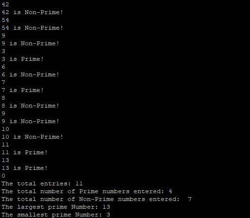
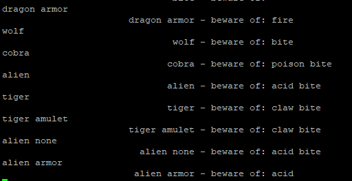
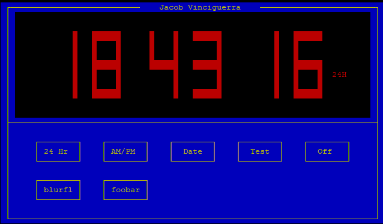
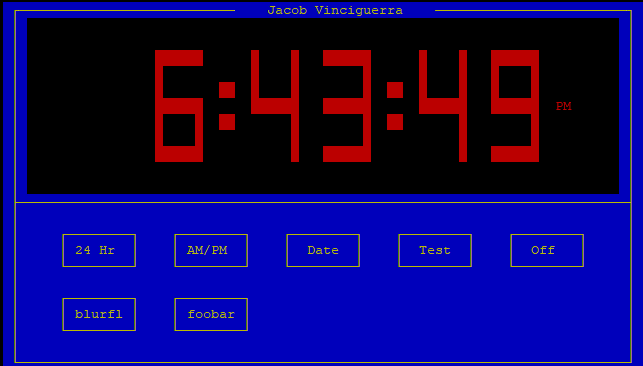
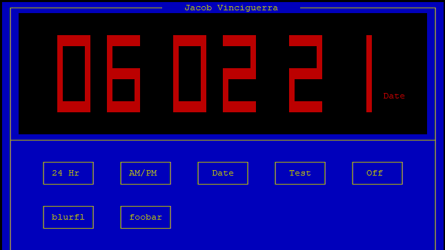

    These are some of the projects that I completed for school, ranging from finding prime numbers to a full clock. 
    These projects were made from a variety of different languages ranging from Awk, C, and C++.

<a target="_blank" 
href="https://github.com/jvinciguerra/SchoolProjects"> 
Projects Repository</a>

<h2> Prime Finder Program </h2>

Below is a screenshot of the Prime Finder Program in action. This was also made using C and another version was made using Awk. Simply do ./primeFinder inside the primeFinder folder, then start typing numbers. The program will see if the number is prime or not and keep a tally of how many prime/non prime numbers were entered. It will also save the largest and smallest prime numbers entered. To exit, type in "0". 

 

<h2> Monsters Program </h2>

Below is a screenshot of the Prime Finder Program in action. This was also made using C. It's a game that is supposed to have the user type in an attack and have what they aren't able to defend against. This was done using bit shifting and masking.
 

 

<h2> Multifunctioning LED Clock </h2>

 Below are different pictures of a multifunctioning clock. Each button on the pictures make the clock operate differently depending what you choose. By default, the clock displays the current time in 24 hour mode:
 

 
Alternatively, if the AM/PM option is selected, it will display the current time in AM/PM mode: 
 

 
The next function is the Date function. When selected, this mode displays the current date: 

 
The last two functions are test and off. Off turns the display off, while test just flashes all of the LEDs. 
To run this program, simply go into the clock directory under "buttons" and do ./clock -l. 

